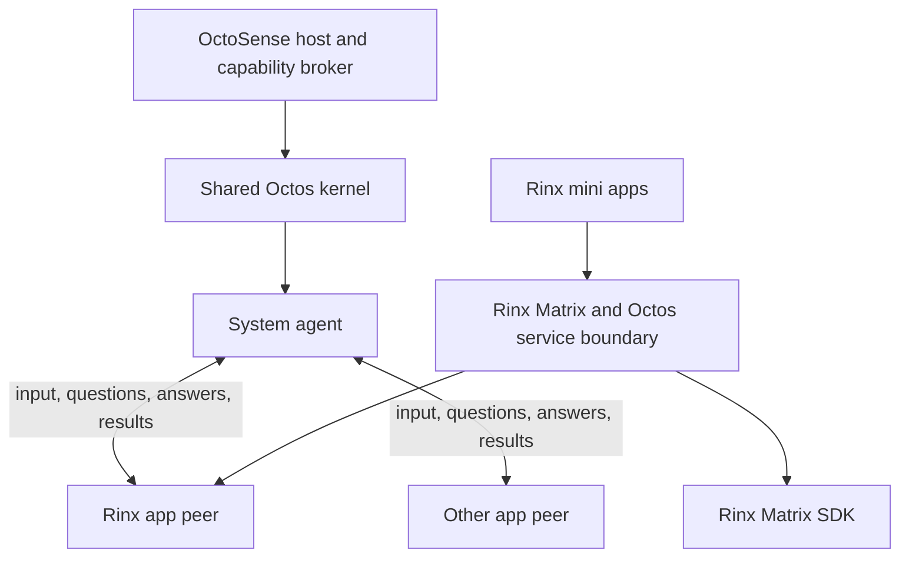

# ADR 0007: Host-owned Octos app peers and Rinx deployment modes

- Date: 2026-09-26
- Status: Proposed; Rinx deployment boundary implemented locally, system-peer
  integration awaiting OctoSense and Octos review.
- Extends [ADR 0005](0005-octoscript-miniapps-matrix-octos.md) and
  [ADR 0006](0006-shared-app-hub-miniapps.md). Proposes replacing AppCard-dependent
  connection discovery and mini-app-owned agent allocation, while retaining the
  shared package format, Matrix contracts and instance grants.

## Context

Rinx runs as a standalone application or a native module in OctoSense desktop
and ROM Home. It also hosts Octoscript mini apps. These are different ownership
boundaries: an OctoSense app can have an app agent, while a mini app inside Rinx
uses services granted by Rinx. A mini app does not need its own Octos kernel,
provider configuration or autonomous peer.

OctoSense should know that an app needs Octos from its native API capability
declaration. When launching an authorized app, the host should create or resume
an app peer owned by the system agent. The system agent and app peer must be able
to exchange input, questions, answers and results throughout the app's lifetime.
Opening an app must not require an LLM to decide whether to establish this link.

The intended deployment uses one Octos kernel and one shared provider profile
per OctoSense user runtime. Apps do not choose independent providers or supply
provider credentials. Selecting a model configured by the system does not require
a separate profile. Separate conversation state and app data remain necessary.

## Decision

### 1. Capabilities determine access; the host owns the peer

Use the same capability vocabulary for native module descriptors and App Hub
manifests. The existing Rinx integration recognizes these service names:

```json
{
  "capabilities": [
    "octos.session.open",
    "octos.session.history",
    "octos.turn.start",
    "octos.turn.interrupt"
  ]
}
```

This is an example subset of a manifest, not a complete package. Each app requests
only what it uses. Admission checks exact registered names; a string beginning
with `octos.` does not automatically grant access. Native linkage to Octos also
does not grant authority. The host intersects declarations with supported APIs,
host policy and user grants, and checks the resulting lease on every request.

At launch, an app with granted Octos access receives a scoped host service handle.
For an app authorized to run an agent, the host creates or resumes its peer on
behalf of the system agent, recording that system session as the originator.
History-only access must not implicitly grant turn execution. Creating a peer
does not itself require a model inference or a background task.

Apps without Octos access do not allocate peers. If an app's AI feature is
optional, its ordinary UI remains usable without a provider. Unsupported required
capabilities make an app unavailable with an explicit reason. This ADR does not
invent an optional-capabilities field in the current manifest schema; any such
schema extension must be agreed with App Hub.

### 2. One system kernel, one app peer, shared provider configuration



The host persists an association between the OctoSense user, app identity,
relevant account scope, peer session, system originator and app workspace.
Reopening an app resumes the intended peer instead of creating an unrelated peer
on every UI mount. A change of Matrix account must not expose a previous account's
history, memory or pending replies. Peer identity and workspace paths come from
the host, never from an app request.

The system agent can send follow-up input, receive progress and results, answer
ordinary peer questions, and interrupt its app peers. App peers can request help
and return information to the system agent. This is an interactive relationship,
not just a single task followed by a final result. Human approvals retain their
existing policy: the system agent's ability to answer a question is not blanket
authority to approve a tool or grant another app's data.

Peers remain directly owned by the system agent. Rinx does not need to spawn
further peers for its mini apps. The current one-level peer delegation rule is
compatible with this topology. Host routing must support launching Rinx without
first opening AppCard or a system-agent chat window.

### 3. Model selection stays under host control

The shared profile owns the provider configuration and credentials. The system
agent or host policy can select an allowed configured model for an app peer.
Apps cannot create provider configurations, change the system default or submit
credentials through the mini-app API.

Octos already supports `peer_handoff` with an optional `model` key naming a
configured `sub_provider`, such as `strong`. The peer stays in the master's
profile. The platform can restrict those configured choices to its selected
provider; the underlying kernel's ability to configure other providers does not
require exposing that choice to apps.

There is a protocol gap to review: the inspected raw OUP `peer/prepare` request
does not accept this model field. OUP `profile/sub_providers/*` manages configured
choices, and `profile/llm/select` changes the profile default; neither is a
verified API for assigning a different model to one existing peer. The host path
needs parity with peer creation through `peer_handoff`, and an explicit contract
for changing an existing peer's model if required. Apply changes between turns
and expose the effective model or fallback. Do not implement this by editing
peer files from Rinx or changing the global default for a single app.

### 4. App data and conversation isolation do not require app providers

Each app has its own workspace, conversation state, scoped tools and limits.
Per-app storage lives under a host-owned app namespace. For Rinx, Matrix account
identity also scopes private data. A future move to separate app processes must
preserve these logical identities and the same service contract.

In current Octos code, a `ProfileRuntime` owns memory, recall and policy as well
as the LLM provider. Therefore sharing a provider profile and giving peers
different working directories does not by itself isolate long-term memory.
The proposed shared-profile design requires app/account namespaces on memory
capture, recall, retrieval and automatic prompt injection. Explicitly shared
system knowledge can be separate from private app memory. The system agent can
obtain app information through authorized peer interactions; app histories must
not automatically become input to every other app.

App isolation is a host/kernel enforcement requirement, not a prompt instruction.
Raw OUP is not handed to untrusted apps: current peer originator checks operate
inside one user's trust domain and do not replace app capability leases. The
broker must bind requests and replies to their app, account and lease generation.
In-process native modules remain trusted code; Splash isolation is not OS process
isolation for arbitrary native Rust.

### 5. Rinx mini apps use Rinx's services

Mini apps keep the package, instance, Matrix account, optional room, storage and
capability boundaries from ADRs 0005 and 0006. They receive neither a kernel nor
an autonomous persistent peer. Rinx mediates their Octos requests through its app
service and the host-managed Rinx agent arrangement.

Mini apps may have separate request or conversation state to prevent one app's
prompts and replies from appearing in another. Such state is not an independent
agent or provider profile. The Octos integration review must choose how to enforce
those request contexts; simply forwarding every mini app into one unrestricted
Rinx transcript is insufficient. Existing ordinary mini-app sessions can remain
as a transitional adapter until equivalent isolation is demonstrated.

A mini app's request must not inherit all of Rinx's Matrix privileges. Reading
room data for AI requires the applicable Matrix read grant and Octos grant.
Posting, editing, deleting and other Matrix actions continue through Rinx's
authorized SDK adapters. A model output cannot expand a mini app's permissions.

## Rinx deployment models

| Concern | Standalone Rinx, desktop or mobile | Rinx inside OctoSense desktop or ROM Home |
| --- | --- | --- |
| UI entry | Rinx owns its window/activity and navigation | Native Rinx module uses the shell's viewport, windows and navigation |
| Current build boundary | Default `standalone` feature | `--no-default-features --features octosense-module`; `rinx::module::RINX_MODULE` |
| Octos ownership | Rinx owns an optional local runtime, or explicitly connects to a configured external provider | OctoSense owns the shared runtime; Rinx receives a scoped service handle |
| Agent role | Rinx's agent is the application root; no OctoSense system agent is assumed | Rinx's agent is a peer owned by the OctoSense system agent |
| Provider settings | Rinx-owned settings for a local runtime, or the external service's settings | Shared OctoSense settings; no duplicate provider setup in Rinx |
| Kernel version | Pinned with the standalone distribution when bundled locally | Pinned by OctoSense; Rinx must be compatible with the host API |
| Private state | Rinx-owned data root with account/app namespaces | Host-provided Rinx namespace, further scoped by account/app |
| Mini apps | Same App Hub packages and Matrix/Octos service contracts | Same App Hub packages and Matrix/Octos service contracts |
| Shutdown | Stop a Rinx-owned local runtime; disconnect without stopping an external runtime | Release Rinx leases; leave the shared kernel and other apps running |

### Deployment selection and packaging

There are two application deployments and three Octos connection modes:

| Application deployment | Octos mode | Selected by | Runtime owner |
| --- | --- | --- | --- |
| Standalone Rinx | Local | Rinx's AI settings | Rinx |
| Standalone Rinx | Remote | Explicit server configuration in Rinx | External Octos service |
| OctoSense native module | Hosted | Module creation by the OctoSense shell | OctoSense |

Hosted mode comes from the native host context, not an editable mini-app field,
environment guess, installed AppCard detection or a failed connection attempt.
Hosted Rinx cannot switch to local or remote ownership from its own settings.
Standalone mode must not silently attach to an unrelated process's provider.
An unconfigured or disabled provider is a normal state in either deployment;
Matrix and the offline editor remain usable.

Keep the existing `standalone` and `octosense-module` entry features. A standalone
desktop release builds Rinx's binary; a shell consumes the Rinx library with its
default features disabled. These existing commands describe the build boundary:

```sh
# Standalone desktop executable, using the default standalone feature.
cargo build --release --locked --bin rinx

# Library integration check; this does not build an OctoSense shell or APK.
cargo check --locked --lib --no-default-features --features octosense-module
```

Standalone Android packaging produces Rinx's own application. Hosted Android
packaging belongs to OctoSense ROM Home and links the module into that host.
Installing a Home test APK is not a ROM flash or a standalone Rinx release.
Desktop and ROM host releases choose their native runtime locks; the standalone
release chooses its own compatible pins. All modules linked into one host must
resolve a single compatible Makepad/Octoscript runtime and service interface.

The local kernel packaging dependency must be optional and separate from the
client/provider interface. A standard standalone package offering local AI ships
one pinned compatible kernel. A hosted Rinx library must not pull that owned
runtime into the shell's build. Cargo feature unification must be checked at the
final host workspace, not inferred from Rinx's feature names alone. New feature
names and platform artifact paths will be chosen in implementation; none are
claimed to exist by the commands above.

### Standalone with a local kernel

Rinx owns a single local runtime for the application, its provider settings and
its private kernel data root. The local runtime can be embedded or an owned child
process according to platform packaging; both use the same OUP service adapter.
Opening another mini app must not create another kernel. The Rinx agent is the
root application agent, so this mode does not manufacture an OctoSense system
agent merely to recreate the hosted peer relationship.

Start the runtime on the first authorized AI operation, or an explicit action in
AI settings. Establish the transport, negotiate supported services and prepare
the account-scoped workspace before enabling agent operations. Starting a
transport is not proof that a provider is authenticated or ready. Report startup
and provider errors in Rinx, with retry; ordinary Matrix use remains available.

Persist non-secret mode/settings separately from protected credentials. Allocate
the kernel root and app workspaces under Rinx-owned storage, independently of an
OctoSense installation or another desktop Octos profile. Do not import that other
profile's provider keys, memories or Matrix credentials implicitly. If a child
process is used, launch the packaged executable directly and track ownership;
do not find a random executable on `PATH` or terminate processes by name.

On shutdown or local-provider replacement, revoke dependent request leases,
cancel or finish owned work according to policy, disconnect and stop only the
runtime Rinx owns. The implementation must verify shutdown rather than assume
that dropping a UI reference terminates the kernel.

### Standalone with a remote kernel

Remote mode is an explicit alternative to local mode. Rinx stores the selected
endpoint, authenticated profile reference and protected transport credential.
The remote server owns model-provider credentials, model configuration and its
kernel lifetime. Rinx does not need an independently configured LLM provider in
addition to the server. Disconnecting or exiting Rinx must not stop the server.

Negotiate the APIs required by the installed mini app and bind each operation to
the authenticated Rinx account/app context. The server must provide or validate
the corresponding remote workspace namespace. A path under Rinx's local data
directory is not a remote workspace, and a remote connection does not grant the
server access to that directory. If scoped workspace provisioning is unavailable,
disable the affected Octos operations with a reason instead of broadening access
or claiming that a connection alone makes the mini app runnable.

Switching servers, profiles or accounts revokes old request authority and drops
late replies before the replacement provider is attached. Local app documents
remain local unless an authorized request explicitly transfers them. Reconnect
restores only the sessions belonging to the selected server and current account.

### Hosted in OctoSense desktop or ROM Home

The shell supplies a scoped Octos service provider when creating the native Rinx
module. The same service contract applies on desktop and mobile. Rinx registers
the required native capabilities so the shell can determine its Octos needs
before launch. The host creates/resumes the Rinx peer under the system agent and
supplies the peer binding together with its app namespace and effective grants.

The hosted module must not initialize a fallback kernel, maintain independent AI
credentials, or require AppCard to publish a connection first. Kernel startup,
model selection and provider configuration belong to OctoSense. Rinx can display
provider availability and an entry to the host's AI settings, but does not offer
an independent endpoint/key form in hosted mode. Missing host services produce
an unavailable AI state without changing the deployment mode.

Closing Rinx releases its leases and subscriptions. It does not retire the host
connection, stop the kernel, terminate another app's work or delete system AI
configuration. Logout also revokes Matrix-account-bound requests and prevents
their later restoration under another account. The shell owns any approved
background work and the persisted Rinx peer's lifecycle.

### Provider contract and division of implementation

Rinx should consume a provider interface, not the shell's process-global raw
connection. The following are contract requirements, not new OUP method names:

| Contract surface | Rinx responsibility | Provider/host responsibility |
| --- | --- | --- |
| Availability and services | Render actual state; reject unsupported calls | Report readiness, negotiated services and replacement/revocation |
| Open an app request context | Supply host-authenticated account/app identity and granted lease | Bind the correct peer/request context and validated workspace |
| Requests and events | Enforce Matrix/mini-app grants; route replies to the originating instance | Enforce effective tools, memory scope and resource limits; correlate events |
| Model/settings presentation | Show effective model/status and the appropriate settings entry | Select configured model and retain provider secrets |
| Cancellation and release | Revoke leases on close/account change; discard stale replies | Cancel scoped work and release context without stopping unrelated work |
| Runtime shutdown | Invoke only for a Rinx-owned local provider | Distinguish owned local lifetime from borrowed hosted/remote lifetime |

Rinx can implement deployment selection, local/remote ownership, provider
injection points, UI state, lease invalidation and tests within its repository.
OctoSense must supply the native injection and root-owned peer binding. Octos
must supply or confirm the remote workspace, peer/model, memory and request-scope
contracts identified above. Until those exist, an adapter must report the
missing capability; it must not substitute a privileged ordinary session and
claim the hosted design is complete.

Preserve the existing account/app storage layout where possible. If a migration
is needed, make it explicit and recoverable. Standalone and hosted installations
must not concurrently open the same Matrix database, transfer login secrets or
merge kernel stores automatically. Deployment mode is a packaging/ownership
choice, not an automatic account migration mechanism.

### Deployment completion criteria

| Mode | Required evidence before marking implemented |
| --- | --- |
| Standalone local | Packaged runtime starts on an authorized request; two mini apps share it with isolated request state; restart restores intended state; Rinx exit stops only its owned runtime |
| Standalone remote | Real authenticated connection and scoped workspace work; profile/account replacement rejects stale replies; exit leaves the server running |
| Hosted desktop | Launch Rinx before AppCard; use the system provider/peer; exchange a question and answer with the system agent; closing Rinx leaves a second app's peer functional |
| Hosted ROM Home | Exercise the same service flow on OnePlus 6, including Back/background/resume and process restart; verify that no Rinx-owned kernel is started |

These criteria complement the cross-repository acceptance list below. Build
checks alone establish neither runtime ownership nor live-service compatibility.
The deployment specification is complete for review; implementing these modes
and recording their evidence remains separate work.

The initial hosted design can run in the OctoSense process. Moving app UIs to
separate processes later changes the broker transport, not kernel ownership.
Per-app kernel instances or independently versioned kernels inside that process
are not part of this decision.

## Lifecycle and resource policy

The host manages peer creation, restoration, input scheduling and termination.
Persist the system originator or explicitly rebind ownership through a supported
kernel operation after restart. An ordinary session with a convenient name is
not a substitute for a correctly registered peer.

Closing a mini app revokes its lease, cancels its pending work where supported and
drops late replies. Closing Rinx releases foreground app resources; background
agent work requires an explicit host policy. Logout revokes account-bound work.
Reopening an authorized app can restore its saved state without keeping every
peer runtime resident while idle.

Concurrent apps need bounded queues, fair scheduling, cancellation and per-app
token/tool limits under the host's total budget. Neither the runtime cache size
nor the per-turn peer-handoff limit is the maximum number of installed apps.
Concrete limits must follow desktop/mobile measurements and provider limits;
this ADR does not claim unlimited parallel turns.

## Implementation evidence and gaps

These are the source findings before the Rinx deployment implementation below,
not a claim that the proposed topology has shipped:

| Area | Inspected implementation | Required integration |
| --- | --- | --- |
| Native Rinx declaration | `src/module.rs` declares `net`, `storage`, `audio.output`, `clipboard`; no Octos capability | Add the agreed native capability declaration and host service injection |
| Native agent control | Rinx's `ServiceExecutor` currently returns unavailable | Define authorized app operations; peer messaging alone does not expose every UI/Matrix action |
| Mini-app capabilities | The pinned Hub policy and Rinx adapters know four `octos.*` services | Coordinate publication, host admission and supported service versions |
| Connection ownership | `KernelProvider::shared` discovers AppCard's published connection | Replace implicit discovery with the shell-owned provider/broker handle |
| Mini-app execution | Each current provider creates an ordinary `rinx-mini-*` session | Implement the app-peer arrangement while preserving request isolation |
| Peer primitives | Octos stages peers, records originators, routes input/questions and supports configured model selection | Bind launch/resume lifecycle to the system agent and host API |
| Memory | Current profile runtime shares memory and recall stores | Add app/account scoping before claiming isolated persistent memory |
| Standalone | Explicit remote connection UI and standalone entry exist | Complete local-runtime provisioning and verify remote workspace behavior |

Relevant Rinx sources: [module](../../src/module.rs),
[Octos adapter](../../src/octoscript_apps/octos.rs),
[package admission](../../src/octoscript_apps/package.rs),
[mini-app UI](../../src/octoscript_apps/ui.rs), and
[build features](../../Cargo.toml).

Octos source evidence is pinned to inspected revision
`6ad76e5c1e659bdf10ec05ae869428b48edccf7f`:
[peer tool model argument](https://github.com/octos-org/octos/blob/6ad76e5c1e659bdf10ec05ae869428b48edccf7f/crates/octos-agent/src/tools/peer_handoff.rs),
[peer ownership and delegation](https://github.com/octos-org/octos/blob/6ad76e5c1e659bdf10ec05ae869428b48edccf7f/crates/octos-cli/src/peers/mod.rs),
[OUP requests and model resolution](https://github.com/octos-org/octos/blob/6ad76e5c1e659bdf10ec05ae869428b48edccf7f/crates/octos-cli/src/api/ui_protocol_transport.rs),
and [profile-owned memory](https://github.com/octos-org/octos/blob/6ad76e5c1e659bdf10ec05ae869428b48edccf7f/crates/octos-cli/src/runtime/profile.rs).
The Rinx capability additions are in
[Hub policy revision b0591e2c](https://github.com/OctoSense-org/OctoSense-App-Hub/blob/b0591e2caa0dc5c62927f7b85dbf826a50618a03/crates/app-policy/src/manifest.rs).
Recheck each consumer's actual pin during implementation; these references are
evidence baselines, not an instruction to downgrade its dependencies.

## Cross-repository review and acceptance

OctoSense owns native capability discovery, broker injection, system-agent
identity, launch/resume and shared AI settings. Octos owns peer/OUP behavior,
memory namespaces and effective per-request tool authority. App Hub owns the
published capability/schema contract. Rinx owns its deployment adapters, Matrix
SDK authority, account scoping and nested mini-app lifecycle.

Before implementation, the OctoSense/Octos review must resolve the host peer
creation/resume API, model selection parity, memory namespaces and isolated
mini-app request contexts. It must also agree how permission prompts reach the
user and what background work survives an app close. No new raw RPC method or
manifest field in this ADR should be treated as an already available API.

Acceptance must cover:

1. Native and Hub declarations select the correct host services; unsupported or
   ungranted calls are denied, and non-AI apps allocate no peer.
2. Rinx and another app run concurrently using one kernel and shared AI settings,
   without opening AppCard first. Both remain independently addressable.
3. The system agent sends input, receives a peer question, answers it, observes
   continuation and interrupts work. Replies and approvals reach the right app.
4. Launch, close, restart and logout preserve ownership and revoke stale leases;
   no old reply reaches a new account or instance.
5. Workspace, transcript, memory and tool tests demonstrate app/account isolation,
   including automatic memory injection and simultaneous Rinx mini-app requests.
6. Selecting a configured model affects only the intended peer, keeps credentials
   with the host and reports fallback; it does not change the profile default.
7. Standalone local and external-provider modes work without OctoSense. Hosted
   Rinx cannot spawn a second kernel, and closing it leaves other peers usable.
8. Current macOS desktop and OnePlus 6 ROM Home builds exercise these flows;
   record native evidence and exact revisions separately from headless tests.

## Rinx deployment implementation

Rinx now exposes `HostedRinxModule` and the host-independent `OctosHost` factory
contract. The module declares its Octos services and accepts a scoped provider.
The legacy module entry explicitly reports AI unavailable when no provider is
injected; it no longer discovers an AppCard connection or starts a fallback.

The `standalone` feature owns the optional OUP transport dependency. Standalone
local/remote setup uses a private transport rather than the process-global
AppCard registry, so replacing it cannot retire another app's connection. Local
mode launches an explicitly selected executable/configuration with a Rinx-owned
data root. Remote mode requires a server workspace root and derives account/app
subdirectories without passing local paths as remote paths. Configuration changes
and shutdown revoke old leases; hosted release never stops the system kernel.

The developer configuration form supports both standalone modes. It persists
non-secret settings atomically and keeps tokens in memory only. Restart restores
the form, with explicit reconnection. This is a deliberate current limit: kernel
bundling, secure token persistence and automatic local-provider restoration are
not implemented. See [the deployment guide](../rinx-deployment.md) for operation
and the shell injection contract.

The host still needs to supply its system-owned Rinx peer, enforce private memory
and request contexts, and resolve the OUP/model questions above. Existing ADR
0005/0006 results do not validate that topology. New Rinx boundary checks are
recorded separately; live provider and OnePlus qualification are still required.

### Rinx boundary verification, 2026-09-26

| Check | Result |
| --- | --- |
| Standalone `cargo test --offline --locked --profile fast --lib octoscript_apps -- --test-threads=1` | 17 passed |
| Hosted equivalent with `--no-default-features --features octosense-module` | 13 passed |
| Hosted dependency graph, macOS host and `aarch64-linux-android` | No `octos-core` package in either graph |
| Owned stdio transport lifecycle | Disposable protocol subprocesses confirm stopping one connection leaves another functional and terminates only the owned child |
| Host boundary | Tests cover missing provider, refusing owned setup in hosted mode, revoked leases, non-AI apps and account identity delivery |
| Source and documentation | Diff whitespace and local documentation links checked |

The subprocess test uses a disposable protocol fixture, not a live model. These
checks include the existing headless Makepad layout/registration tests; no new
APK installation, phone interaction or production remote generation is claimed.

### Related PR review, 2026-09-26

| PR | Reviewed state | Required action |
| --- | --- | --- |
| [Rinx #23](https://github.com/hagency-org/Rinx/pull/23) | Mergeable; native and portable-core checks pass | Independent account-registration change; no deployment rewrite identified |
| [Rinx #24](https://github.com/hagency-org/Rinx/pull/24) | Mergeable; checks pass at `c85e6b4b` | Incorporate the deployment boundary and coordinate dependency pins before shell adoption |
| [ROM #24](https://github.com/OctoSense-org/OctoSense-ROM/pull/24) | Conflicting; Home check failed at `69ebd5fc` | Rebase and retain current runtime/Hub pins; remove the AppCard-default dependency and wire host injection |
| [Desktop #41](https://github.com/OctoSense-org/OctoSense-Desktop/pull/41) | Conflicting; old-head check passed at `6b1be4d0` | Rebase and adapt to current CI; its old green check does not validate the new base |

Both shell PRs retain Hub `b0591e2c` and `www.github.com` patch aliases, and add
AppCard to defaults. Reviewed Desktop main `e3638b4b` and ROM main `b8886fa6`
instead pin Hub `3e993d4c` and Makepad `cd812acd`, keep AppCard opt-in, and enforce
that standard/mobile feature graphs exclude `octos-core`. Merely resolving merge
markers or making AppCard start first would contradict that policy.

Adapt the shell PRs to the shared-service design, rather than merge their current
heads. Preserve current CI guards and pins, normalize dependency identities
without the URL-alias workaround, and coordinate the Matrix/Octos capability
policy with App Hub. Rinx's optional transport split supplies the client-side
dependency boundary; it does not supply the shell broker. No PR was rebased,
pushed or merged during this source review.
