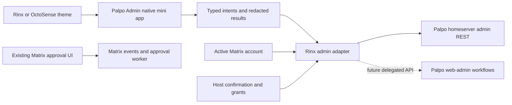

# ADR 0010: Palpo administration as a Rinx system mini app

- Date: 2026-10-03
- Status: Proposed; source review complete. No admin mini app is implemented by
  this record, and no production server was inspected or changed.
- Extends [ADR 0005](0005-octoscript-miniapps-matrix-octos.md),
  [ADR 0006](0006-shared-app-hub-miniapps.md),
  [ADR 0008](0008-rinx-system-app-catalog.md), and
  [ADR 0009](0009-shared-reloadable-themes.md).

## Context and outcome

A Palpo administrator should be able to inspect and manage their homeserver
inside Rinx, using their signed-in Matrix identity and Rinx's shared design
language. Moving between chat, account approvals, and administration should not
require copying an access token or running another client. Ordinary users must
not acquire server authority by installing or opening an app.

There are two existing Palpo administration backends. The Rust homeserver has
admin REST routes. The separate Node `web-admin` service owns Hagency fleet,
project, request, and account-approval workflows. A native frontend must preserve
that distinction: a registered App Service is not necessarily a managed fleet,
and a homeserver admin is not the owner of every fleet or project.

The proposed outcome is **Palpo Admin**, a bundled native Makepad system mini
app, reached through **Discover → Mini apps → Palpo Admin** and a Settings
shortcut. It uses a narrow Rinx admin adapter; it does not embed a Palpo server,
launch Node locally, or hand a server token to Splash, a webpage, or an agent.
The first release is read-only. Later releases add individually reviewed writes
and a native frontend to the existing server-side workflow service.

## Source baseline and existing behavior

The review used these sources, rather than assuming Synapse API parity:

| Source | Revision and relevance |
| --- | --- |
| Rinx `main` | [`3bedeadfd5a6e42cd149b89ea0b8845ee6fe48f9`][rinx-main]; bundled catalog, account-bound mini-app leases, Matrix adapter, accepted theme ADR |
| Rinx theme implementation | [`a2e87dadf8840782de3be6eb23d573e1dfb9b07d`][rinx-theme], [PR #57][theme-pr]; reviewed separately from main, not assumed merged |
| Palpo `main` | [`3f1ad3ba5c80a7206521b3eb4059a4f1f3786700`][palpo-main], fetched on the review date; Rust routes and `web-admin` checked at the same commit |

This is a source-level compatibility review. It does not establish which Palpo
revision or optional services are deployed at `crew.ominix.io:19443`.

### Homeserver APIs

Palpo mounts the same admin routers under `/_palpo/admin` and `/_synapse/admin`,
behind access-token authentication and `require_admin`. MAS endpoints use a
different shared-secret boundary and are outside this app. Rinx should prefer
the Palpo namespace and version its own typed adapters. An alias does not prove
complete Synapse behavior. See [routing and authentication][palpo-auth].

The paths below are relative to `/_palpo/admin` unless stated otherwise. They
are observed routes, not a promise that every one belongs in the first release.

| Area | Observed surface | Proposed treatment |
| --- | --- | --- |
| Identity and version | `GET v1/server_version`; `GET v1/users/{user_id}/admin` | Establish current account authority and show the reported version. Version response contains `server_version`, not a feature manifest. [Version][palpo-statistics], [admin status][palpo-users] |
| Local accounts | `GET v2/users`, `GET/PUT v2/users/{user_id}`; deactivate, reset-password, suspend, admin status, shadow-ban, joined rooms and other routes | Read summary/details first. Split each later mutation into its own operation; never expose the general user JSON object as a patch form. [Source][palpo-users] |
| Known users | `GET v1/known_users` and `/{user_id}` | Separate local accounts from observed remote users. Remote identity details are read-only. [Source][palpo-known-users] |
| Devices | `v2/users/{user_id}/devices`, device detail and deletion | Later sensitive inspection and session revocation; IP addresses and user agents are not overview data. [Source][palpo-devices] |
| Rooms | `v1/rooms`, room detail, members, state, messages, block; `DELETE v2/rooms/{room_id}` and `POST v1/purge_history/{room_id}` | Metadata first. Content inspection and mutations require separate grants; destructive routes stay unavailable until their semantics are validated. [Source][palpo-rooms] |
| App Services | `v1/appservices`, `/{id}`, `/{id}/enable`, `/{id}/disable`, `PUT /{id}/url` | Summary list first. Detail returns credentials; the host must project a redacted result before UI delivery. URL updates have an `expected_url` conflict check. [Source][palpo-appservices] |
| Moderation reports | `GET v1/event_reports`, detail, status update and delete | List metadata first; a report-status update is the first proposed write. Event content is a distinct inspection action. [Source][palpo-reports] |
| Media and statistics | Media detail/deletion, per-room/per-user media, cache purge; `v1/statistics/users/media` | Later storage inspection and reviewed cleanup. Per-room media currently returns fixed empty lists and must remain unavailable; no fabricated CPU, memory or disk dashboard. [Media][palpo-media], [statistics][palpo-statistics] |
| Federation | Destinations, destination rooms, reset connection | Later destination inspection. Several returned timing/order fields are constants in the reviewed implementation; do not turn these into healthy/failed telemetry. [Source][palpo-federation] |
| Registration and notices | Registration-token lifecycle; `POST v1/send_server_notice` | Later separate sensitive operations with explicit recipients and secret handling. [Tokens][palpo-registration], [notices][palpo-notices] |
| Diagnostics and tasks | `v1/debug/*`, `v1/fetch_event/{event_id}`, `v1/scheduled_tasks` | An allowlisted diagnostic subset only. Scheduled tasks currently returns an unconditional empty list; show unavailable, not “no work pending.” [Debug][palpo-debug], [tasks][palpo-tasks] |

Important implementation limits affect the design:

- The room-delete handler disables the room, optionally blocks it, and calls
  history purge while discarding its error. Its `kicked_users` is constructed
  from local members; that response is not evidence of actual membership
  removal. The underlying history purge deletes non-state events and preserves
  state. Neither route supports a truthful “fully erased everywhere” outcome.
  Keep room deletion and purge out of the initial write releases until Palpo
  defines and tests completion semantics. [Handler][palpo-rooms],
  [data implementation][palpo-purge]
- User `PUT` can create a missing account and change several unrelated fields.
  A frontend “edit display name” action must not accidentally become account
  creation or credential reset. An existence check is not an atomic update-only
  guarantee; obtain an upstream precondition/update-only API before promising
  that behavior. Delegated-auth deployments also reject local admin-flag changes.
  [User handler][palpo-users], [authority rule][palpo-admin-rule]
- Admin-room/console commands are a third operational interface, not a stable
  typed transport for the app. No general HTTP config-edit/reload route was found
  in the reviewed admin router. URL-preview settings live in server config;
  a Rinx switch cannot currently apply them. [Config][palpo-preview],
  [console][palpo-console]
- The reviewed router supplies neither a per-operation feature manifest nor a
  general admin audit-feed endpoint. Capability discovery and authoritative
  cross-client audit are upstream work, not services to invent in the UI.

### The optional web-admin service

[`web-admin`][palpo-web] is a separate Node/SQLite service, not a homeserver route
prefix. Its `/api/fleets`, `/api/projects`, `/api/requests`, `/api/audit`, and
account-request routes preserve durable operations, identities, connection
proofs, ownership, and retry state. Reuse those workflows on the server rather
than reproducing them in Rust on every Rinx device.

Its current general browser API uses password login, a short-lived session
cookie, Origin checks and CSRF tokens. The special bearer-authenticated pairing
endpoint is not a general bearer-auth admin API. A Rinx Matrix session cannot
simply be sent as `Authorization` to every `/api/*` route.
[Authentication implementation][palpo-web-auth]

Account decisions already travel as typed Matrix approval events and can use
Rinx's existing approval presentation. The signup approval worker currently
requires an invite-only, non-federated **unencrypted** room; it does not decrypt
rooms. This differs from the encrypted project approval rooms in the fleet
workflow. Preserve the original request/event/digest/identity binding and let
the worker validate the verdict. A new HTTP “approve” button must not silently
bypass that protocol. [Account approval contract][palpo-account-approval]

## Decision

### 1. Ship a native system mini app with a reusable service boundary

Use ADR 0008's native registry, as the article editor does. Proposed identity:
`im.palpo.admin`, display name **Palpo Admin**, native entry `palpo-admin`.
Reserve the exact ID in packaging, developer imports and Hub admission together;
do not let a downloaded manifest impersonate the built-in app.

The proposed implementation boundaries are:

| Component | Responsibility |
| --- | --- |
| `apps/palpo-admin/native/` | Native pages, presentation state, navigation and typed user intents |
| `apps/palpo-admin/bundle/manifest.json` and `system-apps.json` | Build-owned identity, listing and catalog packaging |
| `crates/palpo-admin-core/` | Makepad-free request/result types, operation policy, redaction, pagination normalization and operation state machine; no credentials or networking |
| `src/host/palpo_admin/` | Active SDK account binding, admin leases, fixed endpoint mapping, asynchronous transport, confirmation and result validation |
| Existing Rinx Matrix approval UI | Display and send account-request verdicts through the established Matrix protocol |
| Palpo homeserver and optional `web-admin` | Server authority, data mutations, durable workflow state and server-side audit |

These paths and types are proposed additions. Palpo's server crates, database,
configuration secrets and Node process remain outside the Rinx dependency graph.

Native Rust is trusted application code, not a sandboxed plugin. The adapter
centralizes authority and makes it testable; it does not create OS isolation
between the compiled app and Rinx. The design does not require an LLM or an Octos
runtime. Admin records do not enter assistant context automatically.

The reusable starting points are Rinx's [native app registry][rinx-registry],
[portable account/instance leases][rinx-leases], and
[host Matrix adapter][rinx-matrix]. Extend their existing lifecycle patterns;
ordinary Matrix room leases must not become admin leases implicitly.

### 2. Keep server authority in the host

Bind an admin instance to the signed-in account, SDK session generation, actual
homeserver base URL, app identity and instance generation. The Matrix identity
domain and the HTTP hostname/port can differ. Use the established SDK endpoint,
not a server address supplied by an app argument, room event or remote profile.
The MVP manages only the active account's homeserver. Switching servers means
switching accounts through Rinx's existing account flow.

On explicit launch:

1. Require a signed-in account; show the actual account and server in a persistent
   header. A room owner, high room power level, or Hagency owner is not evidence
   of homeserver administration.
2. Probe the authenticated Palpo version/admin-status routes using the host's
   session, then offer the built-in app's read grants. Palpo's middleware remains
   the authority on every request; a successful probe is not a permanent role.
3. Resolve a per-operation compatibility state. Initially use reviewed response
   schemas and safe reads, with an explicit supported adapter baseline. Do not
   probe a write to discover support. Distinguish 401, 403, an absent route, a
   missing target, timeout and malformed response. A reported version alone
   cannot unlock a new write operation.
4. Issue a short-lived host-only admin lease, separate from ordinary room grants.
   Revoke it on close, logout, account/session change or permission loss. On
   background/resume require fresh authority before new writes. Late responses
   must pass the same account/instance checks before being displayed.

The bearer token remains in the host transport and travels only to that bound
HTTPS endpoint, in a header. Preserve normal certificate verification. Reject
redirects on admin requests; never forward credentials to a redirect destination.
Explicit loopback test fixtures may use HTTP. Tokens do not enter bundle storage,
UI state, URLs, clipboard defaults, telemetry, screenshots or serialized errors.

Requests are typed operations, not `request(method, url, headers, json)`. Encode
identifiers as path segments, bound search fields and page sizes, stream-limit
responses, and map upstream results into minimal DTOs. App Service summaries can
be read without fetching full registration credentials. If later detail requires
the full upstream response, strip secrets inside the host before delivery or
logging; do not retain a generic raw JSON inspector.
Treat names, topics and report text as untrusted display text, without executing
markup or auto-fetching referenced resources. Redact credentials and query secrets
from callback URLs as well as named token fields. Account changes and revocation
clear sensitive view models immediately; the MVP keeps read results in memory,
with no cross-account or persistent admin-data cache.

Reading a room's events, account data, devices or report content is more sensitive
than listing metadata. Grant those operations separately. Server administration
does not supply Megolm keys or authorize automatic use of Rinx's local decryption
keys. Display encrypted event content as unavailable unless an independently
authorized client flow already permits its inspection.

### 3. Do not widen ordinary mini-app capabilities

Rinx's current `matrix.*` adapter and the shared App Contract do not provide
`palpo.admin.*`. The contract rejects unknown capabilities; Rinx's Hub adapter
also checks supported services. Do not hide an admin call behind `matrix.profile`,
generic `net`, an admin-room message or a permissive capability prefix.

For the native release, compile a fixed admin operation descriptor and explicit
grant/confirmation policy beside the native registry. Catalog details and launch
consent must show those native permissions even when the portable manifest has
no admin capability names. Built-in identity alone never grants server access.
Native metadata is build-owned, not a way to admit unknown portable capabilities.

If independent Splash/App Hub distribution becomes necessary, first standardize
exact service names and permission wording in `octosense-app-contract`, then
update policy admission, Rinx dispatch, compatibility and conformance tests.
Candidate names such as `palpo.admin.users.list` are design vocabulary here,
not implemented calls. Initial native delivery does not require this expansion.

### 4. Share the Rinx/OctoSense design language

The app consumes ADR 0009's resolved theme and shared controls. It has no copied
web-admin CSS palette, independent dark-mode preference or hard-coded brand font
scale. Use shared body/metadata/title roles, form controls, table/list rows,
status chips, dialogs, balanced gutters and SVG icons. Keep readable forms
bounded; let tables use available width deliberately.

Desktop uses section navigation with a list/detail layout; compact screens use
the same pages in a navigation stack. Provide labeled actions, keyboard focus,
selectable/copyable IDs and touch-sized targets. Text selection must not initiate
list panning, following Rinx's chat-selection fixes. Back returns to the prior
detail/list, then the mini-app catalog; it does not exit Rinx or OctoSense.

Theme reapply preserves search text, selected records, scroll, pending confirmation
and request identity. It must not issue a second mutation, refetch on every draw,
restart the app or reset its lease. Hosted Rinx inherits OctoSense appearance;
standalone Rinx owns selection. [PR #57][theme-pr] is the concrete implementation
dependency under review; this ADR does not merge it or claim mobile validation.

The page map is:

| Page | User-facing content |
| --- | --- |
| Overview | Account, actual server endpoint, reported version, supported sections and last successful refresh; measured counts only |
| Users | Local accounts and separately labeled known users; paginated search and details |
| Rooms | Room metadata and members; explicit entry into any later sensitive inspection |
| App Services | Registrations, sender, callback and enabled state, with secrets excluded |
| Reports | Report metadata/status; later review and status updates |
| Media / Federation | Added only as reviewed adapters and truthful data become available |
| Diagnostics | Supported checks and actionable errors; no general command terminal |
| Hagency / Account requests | Conditional on configured workflow integration; existing Matrix approval navigation remains usable |
| Activity | Local attempt/result history labeled as local; separate server workflow audit where available |

Unavailable sections explain missing permission or server support. Empty, loading,
stale and failed states are distinct. Search/pagination responses carry request
generation so slow older results cannot replace the current query. Refreshed
data shows its observation time; an offline cache never implies current authority.

### 5. Add writes through explicit operations and verified outcomes

The first write should update a report from `new` to `in_review` or `resolved`.
It is bounded, has a concrete target and can be read back. User lifecycle,
App Service pause/resume, room blocking, notices and cleanup follow individually,
after endpoint-specific integration tests. Do not ship a generic admin console.

For each write, the host presents account/server, target, operation, relevant
before/after fields and consequences. Confirmation creates a one-use authorization
bound to the exact arguments and instance generation, with a short deadline.
Neither a script nor an agent can manufacture that authorization. Re-read target
state where meaningful; if the reviewed state changed, require a new review.
Use upstream compare-and-set when available. A local re-read alone does not
prevent a concurrent server change and must not be described as atomic.

Track `prepared → confirmed → sending → verified`, plus `failed`, `partial` and
`unknown`. Disable duplicate submission while sending. Timeout after dispatch
means unknown outcome; reconcile with a read before offering a retry. Ordinary
admin endpoints do not have universal idempotency keys. A local request UUID is
correlation, not server-side deduplication. Never replay a write automatically
on reconnect, redraw, theme change or restart.

Closing the app cancels local work and revokes authority but cannot undo a request
already accepted by Palpo. Preserve a minimal account-scoped receipt for a write
whose result is unknown; on a later authorized launch, offer reconciliation.
Keep local receipts bounded and redact secrets and message bodies. They are not
an authoritative or tamper-proof server audit. A shared admin audit API is a
separate Palpo deliverable.

High-impact operations need stronger completion contracts before release:
account deactivation, credential reset, admin-role changes, token issuance,
registration import/export, media deletion and history purge. In particular,
keep arbitrary JSON signing, login-token impersonation, MAS secrets and shell
commands out of this app. Server-side protection of privileged/last-admin
accounts cannot be replaced by disabling a button in Rinx.

### 6. Reuse Hagency workflows through a deliberate server integration

Keep fleet IDs, credentials, operation plans, connection proof, queue/retry state
and audit in the existing service. Preserve current role distinctions: server
admin, exact fleet owner, project owner/member and Hagency decision maker.
“Registered,” “connected,” “approved,” “fulfilled” and “agent joined” remain
different states. Do not convert a pending or stale observation into success.

Do not change a managed fleet by directly toggling its underlying App Service
behind the workflow registry. Once the workflow adapter identifies a managed
registration, route its operations through that service. Unknown ownership is
not proof that direct mutation is safe; the initial App Service surface is
read-only.

For a native workflow release, add a versioned API and delegated-session contract
in Palpo/web-admin. Bind a short-lived credential to the operator-configured
service audience, actual Matrix identity, scopes and expiry, with revocation and
server-side checks for each operation. Rinx must not forward its long-lived
Matrix session token to a URL discovered from chat or entered by a mini app.
The service needs a compatible upstream authorization mechanism for its Palpo
calls; replacing browser login with a new token header alone is insufficient.
This is coordinated server work, not an API that exists today.

Until that contract is implemented, keep native fleet controls unavailable.
An explicitly configured link may open the existing web console with its normal
independent login, but that is an optional escape route, not native completion.
Do not weaken Origin/CSRF checks or inject credentials into the tabbed browser.

Account requests can initially deep-link to their existing Matrix approval
events. Preserve request IDs exactly, including the supported 40-hex identifiers,
and reuse the established verdict serializer. No passwords, worker keys or
registration credentials move into the mini app. Backend verification and the
subsequent registration result remain authoritative. The existing
[Rinx approval parser and Palpo fixture test][rinx-approval] provide the client
baseline; native end-to-end approval still needs its own validation.

### 7. Make URL-preview diagnostics honest

The earlier missing web-card issue is a useful concrete administration task.
Offer an explicit test of one selected public URL through the homeserver's
authenticated `/_matrix/client/v1/media/preview_url` endpoint. Show success,
authorization failure, policy denial or unavailable endpoint based on the actual
response; do not treat every 403 as proof of a particular config setting.

The reviewed Palpo config defaults to empty allowlists. Explain applicable
`url_preview` settings and link to deployment instructions. Keep “change preview
policy” unavailable until Palpo supplies a narrow, redacted config read/write
contract with revision checks, validation and an explicit reload/restart outcome.
Do not expose arbitrary config files, shell access or a one-click allow-all
switch. [Config source][palpo-preview]; [documentation PR #504][preview-pr]

## Delivery and validation

### Phase 1: read-only MVP

Implement catalog registration, native grant presentation, the account-bound
broker, and Overview, Users, Rooms, App Services and Reports. Limit results to
reviewed summary/detail metadata. Exclude raw registrations, event bodies,
device/IP inspection, registration tokens and writes. Include account switching,
Back navigation, refresh/pagination, supported/forbidden/offline states and live
theme reapply from the first slice.

The visible acceptance scenario is: sign into a disposable Palpo as an admin,
open Palpo Admin from Mini apps, search a seeded user and room, inspect a redacted
App Service and report, change the theme without losing the search/selection,
then switch to a non-admin account and verify that the prior data disappears
and fresh access is denied. No token paste or second login is needed for these
homeserver reads.

### Phase 2: controlled writes and diagnostics

Add the report-status action, native confirmation, receipts, readback and unknown
outcome recovery. Add URL-preview diagnostics. Expand operations one at a time
using the same gates; do not interpret this phase as automatic approval to ship
all of Palpo's admin routes. Incomplete room-delete/purge behavior and missing
update-only user semantics require upstream work first.

### Phase 3: native workflow frontend

Agree and implement the delegated web-admin API, then port fleet/project/request
views onto the existing backend. Add account-request navigation and workflow
audit without creating a second workflow database. Reuse backend request IDs and
conflict rules. Validate native Rinx approval interaction separately from the
backend's existing fixture tests. Portable Hub distribution is a later option
requiring the shared capability-contract work, not an MVP dependency.

### Required evidence

| Layer | Required checks before claiming delivery |
| --- | --- |
| Portable core | Operation allowlist, bounded arguments/results, path encoding, redaction, pagination/schema handling, consent binding, duplicate prevention and unknown-outcome state transitions |
| Host transport fixtures | Admin/non-admin, expired token, lost authority, account/server switch, delayed reply, app close, redirect, wrong response schema, 404 route vs target, 429/backoff, timeout, oversized bodies and secrets absent from errors/results |
| Package isolation | Built-in ID spoofing refused in local/Hub installs; normal `matrix.*`, `net`, Splash and assistant grants cannot call admin operations; catalog permission text matches the compiled operation set |
| Disposable Palpo integration | Pin server commit, use a separate PostgreSQL database, seed distinct admin/non-admin/remote identities and App Services; verify real auth, pagination and response redaction; later writes must read back actual database-backed state |
| Native Makepad instrumentation | Actual draw and input on wide and compact layouts; navigate/search/select/scroll, copy IDs, Back/Escape, loading/denied/offline states, theme and text-scale changes with state preservation; count requests to catch duplicate fetch/write on reapply |
| Mutation faults | Drop a response after the server commits; show unknown, reconcile once and avoid replay; close/logout while in flight; changed target invalidates confirmation; cancellation sends no write |
| Workflow integration | Separate admin/owner/member identities, no cookie/CSRF bypass, delegation expiry/revocation, original approval-event binding, stable retry IDs, stale connection proof and partial fulfillment shown truthfully |
| Deployment/platform | Standalone and `octosense-module` builds; test the hosted shell as well as Rinx's standalone harness. Record Android and OpenHarmony touch/Back/keyboard/lifecycle/device evidence independently of desktop tests |

Use isolated Rinx data directories and disposable accounts. Native tests should
extend the existing system-app and theme instrumentation patterns, collect widget
bounds/state, screenshots and input results, and identify the tested binary and
server revisions. A mocked server proves host behavior; it does not prove Palpo
integration. A successful macOS test does not establish Android/OpenHarmony
support. The native design avoids a WebView dependency, but each target still
needs its own build, credential/lifecycle integration and device validation.

This ADR change requires only documentation/link/whitespace checks. It does not
claim that the proposed Makepad tests or server integration tests have run.

## Alternatives and consequences

| Alternative | Assessment |
| --- | --- |
| Embed the existing web console | Useful optional navigation, but preserves its separate login and CSS, covers different workflows, and adds WebView platform dependencies. It does not satisfy the shared native UX goal. |
| Give an OctoScript bundle the admin token and generic HTTP | Easy prototype, but delegates the account's full server authority and bypasses existing narrow grants. Rejected. |
| Make an independent Hub app first | Requires shared admin capability definitions and a supported host adapter before it can work safely. Preserve this path after the native service contract is proven. |
| Build all screens into Rinx Settings | Could reuse native widgets, but mixes server operations with personal preferences. Prefer the existing system mini-app lifecycle and a Settings shortcut. |
| Send formatted admin commands to a Matrix room | Existing operator tool, but text parsing, response correlation and command exposure make it unsuitable for the app's typed operation contract. |
| Embed Palpo or copy web-admin workflow logic | Duplicates server ownership and persistent operation state on clients. Rejected. |

The native choice gives Rinx and hosted OctoSense one theme, navigation model and
credential boundary. It also ties initial app updates to Rinx releases and makes
Rinx maintain a small Palpo API adapter. The first useful version can ship with
existing homeserver read endpoints; complete fleet administration, trustworthy
destructive operations, config editing and global audit require explicit server
deliverables. The feature must retain those limits in its UI and release notes.

## Pinned references

[rinx-main]: https://github.com/hagency-org/Rinx/tree/3bedeadfd5a6e42cd149b89ea0b8845ee6fe48f9
[rinx-theme]: https://github.com/hagency-org/Rinx/tree/a2e87dadf8840782de3be6eb23d573e1dfb9b07d
[rinx-registry]: https://github.com/hagency-org/Rinx/blob/3bedeadfd5a6e42cd149b89ea0b8845ee6fe48f9/src/system_apps.rs
[rinx-leases]: https://github.com/hagency-org/Rinx/blob/3bedeadfd5a6e42cd149b89ea0b8845ee6fe48f9/crates/miniapp-core/src/lib.rs
[rinx-matrix]: https://github.com/hagency-org/Rinx/blob/3bedeadfd5a6e42cd149b89ea0b8845ee6fe48f9/src/host/matrix/mod.rs
[rinx-approval]: https://github.com/hagency-org/Rinx/blob/3bedeadfd5a6e42cd149b89ea0b8845ee6fe48f9/src/agent_chat/approval.rs
[theme-pr]: https://github.com/hagency-org/Rinx/pull/57
[palpo-main]: https://github.com/palpo-im/palpo/tree/3f1ad3ba5c80a7206521b3eb4059a4f1f3786700
[palpo-auth]: https://github.com/palpo-im/palpo/blob/3f1ad3ba5c80a7206521b3eb4059a4f1f3786700/crates/server/src/routing/admin.rs
[palpo-statistics]: https://github.com/palpo-im/palpo/blob/3f1ad3ba5c80a7206521b3eb4059a4f1f3786700/crates/server/src/routing/admin/statistic.rs
[palpo-users]: https://github.com/palpo-im/palpo/blob/3f1ad3ba5c80a7206521b3eb4059a4f1f3786700/crates/server/src/routing/admin/user_admin.rs
[palpo-known-users]: https://github.com/palpo-im/palpo/blob/3f1ad3ba5c80a7206521b3eb4059a4f1f3786700/crates/server/src/routing/admin/known_user.rs
[palpo-devices]: https://github.com/palpo-im/palpo/blob/3f1ad3ba5c80a7206521b3eb4059a4f1f3786700/crates/server/src/routing/admin/user.rs
[palpo-rooms]: https://github.com/palpo-im/palpo/blob/3f1ad3ba5c80a7206521b3eb4059a4f1f3786700/crates/server/src/routing/admin/room.rs
[palpo-appservices]: https://github.com/palpo-im/palpo/blob/3f1ad3ba5c80a7206521b3eb4059a4f1f3786700/crates/server/src/routing/admin/appservice.rs
[palpo-reports]: https://github.com/palpo-im/palpo/blob/3f1ad3ba5c80a7206521b3eb4059a4f1f3786700/crates/server/src/routing/admin/event_report.rs
[palpo-media]: https://github.com/palpo-im/palpo/blob/3f1ad3ba5c80a7206521b3eb4059a4f1f3786700/crates/server/src/routing/admin/media.rs
[palpo-federation]: https://github.com/palpo-im/palpo/blob/3f1ad3ba5c80a7206521b3eb4059a4f1f3786700/crates/server/src/routing/admin/federation.rs
[palpo-registration]: https://github.com/palpo-im/palpo/blob/3f1ad3ba5c80a7206521b3eb4059a4f1f3786700/crates/server/src/routing/admin/registration_token.rs
[palpo-notices]: https://github.com/palpo-im/palpo/blob/3f1ad3ba5c80a7206521b3eb4059a4f1f3786700/crates/server/src/routing/admin/server_notice.rs
[palpo-debug]: https://github.com/palpo-im/palpo/blob/3f1ad3ba5c80a7206521b3eb4059a4f1f3786700/crates/server/src/routing/admin/debug.rs
[palpo-tasks]: https://github.com/palpo-im/palpo/blob/3f1ad3ba5c80a7206521b3eb4059a4f1f3786700/crates/server/src/routing/admin/scheduled_task.rs
[palpo-purge]: https://github.com/palpo-im/palpo/blob/3f1ad3ba5c80a7206521b3eb4059a4f1f3786700/crates/data/src/room/timeline.rs
[palpo-admin-rule]: https://github.com/palpo-im/palpo/blob/3f1ad3ba5c80a7206521b3eb4059a4f1f3786700/crates/server/src/user.rs
[palpo-preview]: https://github.com/palpo-im/palpo/blob/3f1ad3ba5c80a7206521b3eb4059a4f1f3786700/crates/server/src/config/url_preview.rs
[palpo-console]: https://github.com/palpo-im/palpo/blob/3f1ad3ba5c80a7206521b3eb4059a4f1f3786700/crates/server/src/admin/server/cmd.rs
[palpo-web]: https://github.com/palpo-im/palpo/blob/3f1ad3ba5c80a7206521b3eb4059a4f1f3786700/web-admin/README.md
[palpo-web-auth]: https://github.com/palpo-im/palpo/blob/3f1ad3ba5c80a7206521b3eb4059a4f1f3786700/web-admin/server.mjs
[palpo-account-approval]: https://github.com/palpo-im/palpo/blob/3f1ad3ba5c80a7206521b3eb4059a4f1f3786700/web-admin/deploy/account-approval.md
[preview-pr]: https://github.com/palpo-im/palpo/pull/504
