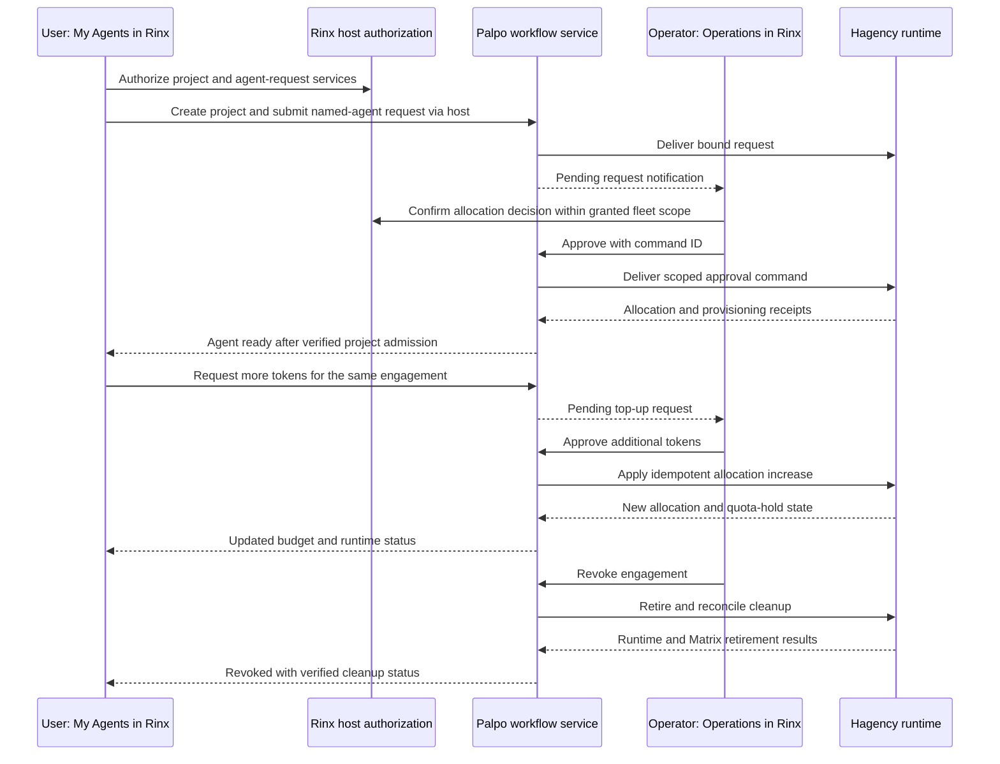

# ADR 0010: Palpo and agent administration through Rinx OctoScript mini apps

- Date: 2026-10-03
- Status: Proposed; revised after product review. Source mapping complete;
  implementation and end-to-end validation remain open.
- Extends [ADR 0005](0005-octoscript-miniapps-matrix-octos.md),
  [ADR 0006](0006-shared-app-hub-miniapps.md),
  [ADR 0008](0008-rinx-system-app-catalog.md), and
  [ADR 0009](0009-shared-reloadable-themes.md).
- Replaces this proposal's initial choice of a compiled native admin dashboard
  and read-only first release. The intended product is a complete agent/project
  workflow inside Rinx, delivered through OctoScript mini apps.

## Product decision

People sign into Rinx once with their Matrix account. They open an appropriate
mini app, authorize its requested services through a Rinx-owned sheet, and
create, request, approve, allocate, manage and retire agents without visiting a
web console or remembering another password. The same flow serves desktop,
Android and OpenHarmony, with platform validation required before release.

Ship two first-party OctoScript packages, using the existing signed App Hub
format and Splash runtime:

| Mini app | Audience and pages |
| --- | --- |
| Palpo Operations | Authorized server administrators and fleet operators: Requests, Projects, Agents, Fleets and Activity; resource approval, assignment, budget decisions and retirement within their granted scope |
| My Agents | Project owners and authorized members: My projects, My agents, Requests and Approvals; create/request an agent, inspect usage, request more tokens, exercise permitted management actions and use the agent in chat |

These are product surfaces, not new account systems. One Matrix identity can
hold several roles. The backend returns the actions that identity may perform,
scoped to a server, fleet, project and engagement. An administrator who also
operates a fleet can approve its requests in Operations. Owning a Matrix server
alone does not confer authority over another contributor's resource pool.

Reuse the server logic currently housed in Palpo's `web-admin` service, while
making its browser frontend optional. Reuse Hagency's agent/runtime/allocation
engine. All required human steps must have an in-Rinx path. Do not make “open
the web console” an implementation dependency or the completion state of a
mini-app workflow. Infrastructure installation still happens on the server;
ongoing registration, pairing and workflow decisions must be manageable in Rinx.

The mini apps render through OctoScript/Makepad and use ADR 0009's shared theme.
Rust code in Rinx supplies bounded host services and trusted authorization UI;
it does not implement a second copy of each application page. UI bundles can
update independently once the host contract is installed. New host capabilities
still require a compatible Rinx release. A Splash isolate is not an OS process.

## Source baseline

| Repository | Reviewed source |
| --- | --- |
| Rinx main | `3bedeadfd5a6e42cd149b89ea0b8845ee6fe48f9`; [mini-app dispatch][rinx-dispatch], [leases][rinx-leases], [catalog admission][rinx-catalog] |
| Rinx theme work | `a2e87dadf8840782de3be6eb23d573e1dfb9b07d`, [PR #57][theme-pr]; not assumed merged |
| Palpo main | `3f1ad3ba5c80a7206521b3eb4059a4f1f3786700`; [HTTP routes][palpo-http], [workflow][palpo-workflow], [service operations][palpo-service] |
| Hagency Rust main | `e51a0b1385437c7b5e6893e68233b8173a0db018`; [engagement operations][hagency-engagements], [agent operations][hagency-agents], [allocation ADR 186][hagency-allocation] and [fleet service ADR 187][hagency-fleet] |

The current Rust Hagency baseline matters. It already supports approving an
adjusted allocation, increasing an existing allocation, quota pause/resume and
retirement. Those operations need a scoped Rinx/Palpo integration; the allocation
engine does not need rebuilding. This review does not identify the versions
actually deployed at `crew.ominix.io:19443`.

## Current functions mapped to the mini-app flow

“Exists” below means source implementation exists behind its current authority.
It does not mean a Rinx mini app can call it today. Palpo browser endpoints use
cookies/CSRF; Hagency console endpoints use their own trusted console session.
Both need the integration described below.

### Palpo Operations

| User action inside Rinx | Existing implementation to reuse | Remaining work |
| --- | --- | --- |
| Register a Hagency and assign its owner | Palpo `POST /api/fleets` persists registration, owner, namespace, credentials and operation ID | Expose a scoped host call and in-app form; keep machine credentials out of script |
| Pair and verify the fleet | Owner-bound `/api/my/fleets/{id}/pair` and `/connect`; outbound relay/probe proof | Replace configuration download/import with an in-app one-time claim flow completed by the Hagency service; do not declare connected before the real probe succeeds |
| Inspect projects and agents | Palpo `/api/projects`, `/api/requests`, `/api/fleets/{id}/agents`; Hagency engagement/agent views | Role-filtered, paginated projections; current Palpo project listing is membership/owner based, not a global admin project directory |
| Approve an agent request and assign its allocation to its project | Hagency `POST /console/api/engagements/{id}/approve` with `commandId` and optional `allocatedTokens` | Matrix-user-to-fleet-operator authority, remote control delivery and receipts; use the admitted project's/resource's binding |
| Reject a pending request | Hagency `POST /console/api/agents/{id}/refuse`, whose ID is the engagement ID | Expose a clearly named request-decision service, preserving pending-only and command replay checks |
| Approve additional tokens | Hagency `POST /console/api/engagements/{id}/allocation` with `commandId`, `addTokens` | Add a user top-up request/decision record and authorize this exact increase; the existing command is an operator action, not a user request API |
| Start/stop or manage an agent | Hagency `/console/api/agents/{id}/start`, `/stop`, `/preset` and other lifecycle routes | Define fleet/project-specific operator and owner permissions; wrap a small explicit operation set instead of exporting the console |
| Revoke an allocation | Hagency `/console/api/engagements/{id}/retire`, `/cleanup-retry`; Palpo fleet-authenticated `retire-agent` path and Matrix identity deactivation | Route the request to the owning runtime and project the complete cleanup state; distinguish allocation revocation, process stop and Matrix retirement |
| Pause/resume/revoke a whole fleet | Palpo `/api/fleets/{id}/pause`, `/resume`, `/revoke` | Preserve current scope: registration credential state, not proof every process/session stopped; fleet-wide cleanup needs a defined backend workflow |
| Review activity | Palpo `/api/audit`; Hagency `/console/api/engagements/audit` | Correlate actor, request and command IDs; filter by role and preserve source ownership |
| Review account signup | Palpo account-request worker and typed Matrix approval events; existing Rinx approval UI | Deep-link to the original request and reuse its verdict/binding checks; do not turn a resource approval into an account approval |

“Assign” initially means approving the admitted request into its bound project.
Hagency currently fixes the resource at admission; the candidates route exposes
that binding/headroom. Arbitrary reassignment of a running agent to another
project or resource needs a separate transition, ownership checks and cleanup.
Do not implement it as an editable `projectId` or a room invite.

### My Agents

| User action inside Rinx | Existing implementation to reuse | Remaining work |
| --- | --- | --- |
| Browse available agents/resources | Palpo `GET /api/catalog` publishes fleet roles and resource definitions | Mini-app list/filter/detail screens; show observed age and availability |
| Create a project or attach an existing room | Palpo `POST /api/projects` with fleet/name/optional room; creates project binding and private approval room | Host-owned room picker and scoped consent; preserve server ownership/membership checks |
| Create/request an agent | Palpo `POST /api/requests` accepts role, initial tokens, daily rate and `agentDefinition` with name/resource ID | Mini-app form and progress UI. Creation means a request followed by allocation/provisioning, not immediate runtime creation |
| Track the request and use the agent | Palpo `GET /api/requests` verifies reported fulfillment and actual project membership | Durable in-app request page, safe navigation to chat, background notification and resume |
| View usage and remaining allocation | Hagency console exposes allocation, observed spend and quota hold; Palpo currently forwards allocated tokens | Add scoped usage/status fields to publication and Palpo's projection; preserve unknown/stale usage rather than displaying zero |
| Request more tokens for the same agent | Hagency already has the allocation-increase command | New durable request tied to the existing engagement, desired increase and reason; route to the authorized decision maker, then invoke the existing command once |
| Rename or change agent settings | Palpo identity update changes display name only; Hagency has runtime management operations | Define the owner-editable subset and enforce it server-side. Matrix display name, model/resource, prompt/identity and permissions are different changes |
| Stop/release an agent | Hagency lifecycle and retirement operations exist for operators | Define which actions project owners may invoke directly and which become requests; no implicit access to operator-wide APIs |
| Approve an agent's execution request | Rinx's existing Matrix approval handling and Hagency's private approval protocol | Open the original bound approval within Rinx; keep business allocation approval and execution/tool approval separate |

A new allocation request must not be used as an imitation top-up: it may create
a second agent. A top-up keeps the same engagement, agent, project and usage
history, and adds only the authorized amount.

## One login, explicit authorization inside Rinx

Mini-app consent, server role and business approval are three different checks.
A user can consent to an app acting for them; that cannot grant them a role they
do not possess or approve a provider's resources for themselves.

The intended launch flow is:

1. Rinx verifies the installed package and identifies its publisher, digest and
   declared exact host services. It supplies the signed-in Matrix account; the
   script cannot supply a replacement user or credential.
2. A Rinx-owned authorization sheet appears within the mini-app flow: for example,
   “My Agents can view projects you belong to and submit agent/token requests as
   @alice:example.org.” Show project/fleet scope and any sensitive write separately.
   Existing grants can be reused within their scope; do not prompt on each read.
3. Rinx binds the grant to account/session, package/digest, operation set, selected
   resources and instance generation. The app receives a service result or opaque
   handle, never a password, Matrix bearer, App Service secret or operator token.
4. A Palpo-owned integration API authenticates that session and checks current
   membership and roles for every operation. It returns allowed actions and scoped
   data. UI hiding is not authorization.
5. For Hagency resource decisions, the service checks the fleet's explicit operator
   delegation and forwards a bounded command to that Hagency. Hagency validates
   the actor/delegation/target and its own capacity/state rules before committing.
6. Closing/logging out or removing authorization stops future calls and delivery
   to that instance. It does not undo an already committed request. Reopening
   restores its canonical server status with fresh authorization.

Implement the workflow API under a versioned Palpo-owned namespace; the precise
route is a new contract, not an existing endpoint. Rinx sends its Matrix authority
only to the already bound homeserver endpoint. The server can mint a short-lived,
scoped grant held by the host for this app. If a separate service accepts grants,
it must have an operator-configured audience, authenticated issuer and revocation
rules. Do not forward the Rinx token to a mini-app-supplied URL.

Adapt the existing workflow handlers behind this boundary rather than scraping
browser pages or simulating browser cookies/Origin headers. Preserve the actual
Matrix actor for room creation, state writes and request events. A private
service-to-service actor header is insufficient unless authenticated and verified;
a service account must not silently impersonate a user's business authority.

The fleet owner explicitly delegates resource-management rights to authorized
Matrix identities, which may include the Palpo administrator. This association
is established once through authenticated fleet enrollment, not by accepting a
caller-provided `isAdmin`, `ownerMxid` or operator role. Runtime machine credentials
remain on the server. An in-Rinx pairing sheet can authorize a short-lived,
single-use claim consumed directly by the runtime, avoiding manual secret files.
The initial binding must prove control of the existing runtime/fleet; possession
of a chosen display name or fleet ID is not enough.

## Host contract and distribution

Use ordinary signed OctoScript bundles with `main.splash` or the supported L0
entry format. Suggested package identities are `im.palpo.operations` and
`im.palpo.agents`, subject to publisher coordination. Share script components and
response types; keep package permission sets separate. Bundling initial versions
with Rinx is compatible with this design, but must not turn them into native
registry entries or grant undeclared authority.

Rinx currently dispatches Matrix and Octos services only. The shared App Contract
has a closed capability set, and Rinx catalog compatibility has its own service
allowlist. The existing `prompt` mechanism is not by itself an admin grant; its
admission and trusted sheet behavior also need integration. Update the contract,
policy, plain-language permission descriptions, catalog and host dispatch together.
Older hosts show “requires a newer Rinx” instead of silently dropping capabilities.

Proposed service groups, not existing callable APIs:

| Group | Examples and scope |
| --- | --- |
| Discovery and scoped reads | `palpo.catalog.list`, `palpo.projects.list`, `palpo.agents.get`, `palpo.requests.get` |
| User intents | `palpo.projects.create`, `palpo.agents.request`, `palpo.allocations.request_increase` |
| Authorized decisions | `palpo.requests.decide`, `palpo.allocations.decide_increase`, `palpo.engagements.retire` |
| Fleet operations | `palpo.fleets.register`, `palpo.fleets.pair`, `palpo.fleets.set_state` |

Every actual service needs a bounded argument/result schema, explicit role/scope,
error vocabulary, version requirements and an idempotency policy. Do not expose
arbitrary URLs, HTTP methods, SQL, shell commands, console sessions or raw JSON
patches. Updating a package to ask for broader services requires renewed consent.
Execution/tool approval uses the existing trusted host mechanism, not a new
script-created approval token.

## Backend gaps that must be implemented

| Obstacle | Current evidence | Required change |
| --- | --- | --- |
| Matrix session to workflow authentication | Palpo browser API expects its login cookie/CSRF; Hagency console uses separate console authority and rejects Authorization headers | Add the Palpo-owned authenticated app boundary and fleet-specific delegation; reuse existing domain functions, not browser middleware bypasses |
| Remote operator commands | Palpo outbound work currently carries request/probe; Hagency's worker accepts those kinds, not generic approve/top-up/retire commands | Extend the versioned machine protocol with finite command kinds, actor/scope proof, command IDs and execution receipts; retain outbound polling so no new public Hagency listener is needed |
| Ordinary user's top-up workflow | Hagency has operator allocation increases, but no reviewed Palpo user top-up request/decision API | Add durable request, approve/reject, pending/expired/conflict states and exactly-once increase through existing command-ID handling |
| Complete user-visible status | Hagency's Palpo projection and Palpo's allowlist omit observed spend and quota hold; terminal states/cleanup lose detail in the public projection | Add versioned usage, pause, cleanup and observation fields end to end; do not infer them from an allocation number or heartbeat |
| Self-service management and administrator assignment | Existing lifecycle routes use broad console authority; project reads follow Matrix membership; resource choice is fixed at admission | Define resource/project-specific roles and owner-editable actions; add scoped admin directory/assignment APIs where needed |
| Seamless pairing | Current owner retrieves registration data and imports it in Hagency | Add an authenticated one-time runtime claim completed from Rinx; no script-visible machine secrets or browser handoff |
| Mobile lifecycle and notifications | Script/runtime and Matrix integration foundations exist, but these workflows have no device evidence | Persist server operation IDs, resume after background/kill, route notifications to the correct account/app/request, and validate Android/OpenHarmony |
| Encryption/trust readiness | Project work currently requires a plaintext invite-only room, while private execution approval uses Megolm; fleet enrollment pins owner cross-signing keys | Explain and enforce current room policy; guide missing verification in Rinx, preserve owner-specific approval devices and key-change handling |

The [current Hagency console][hagency-console] is not a remote API to expose
unchanged: its sessions and reads belong to the operator trust domain. New
scoped reads must not leak other owners' agents, usage, room IDs or private
approval state. The [outbound transport][palpo-outbound] is reusable delivery
infrastructure, not proof of authorization or successful command execution.

For a delivered command, bind server/fleet registration generation, actor,
role/delegation revision, project, engagement, operation, argument digest,
command ID and expiry. Recheck authority when the command executes, after any
offline wait. Persist receipt before acknowledgment; an ACK records transport
receipt, not a business decision. Retry the same command ID after a lost reply;
changed content must conflict. A revoked delegation invalidates queued work.

An approval/top-up commits through Hagency's existing capacity transaction and
command replay logic. A stale UI balance is never a promise of available capacity.
Top-up request state and its command receipt must reconcile across a crash without
applying the increase twice. Usage is measured asynchronously: current quota
pause lets a running turn finish and gates subsequent dispatch. Do not market it
as an instantaneous hard spending cap. [Allocation behavior][hagency-allocation]

Retirement needs separate fields for decision recorded, runtime cleanup and Matrix
access removal. Fleet disable currently only changes App Service credential state.
Manual Palpo identity retirement does not prove a remote runtime stopped. Preserve
partial/unknown results and retry the failed cleanup, not the allocation decision.
[Palpo operations][palpo-service], [Hagency retirement][hagency-engagements]

## The complete in-Rinx flow

All mini-app network intents in the diagram pass through the Rinx host, even
where the arrows omit that hop. Each human uses their own Matrix identity. A
single person holding both roles can open both apps without another login.

The mobile UI uses short forms, lists and detail pages: choose a project, name
an agent, choose an offered role/resource, set initial tokens and submit. Hide
protocol IDs behind details and copy actions. Generate stable request IDs in
trusted code and retain them across retries. Show who must act next, what is
pending and the server-observed result. A notification opens the exact request
inside the appropriate mini app, with fresh authorization.

The same theme snapshot styles both packages and host sheets. Reapply preserves
form drafts, focus, selection, navigation and request IDs. It must not resubmit
a decision, recreate an agent or duplicate a top-up. Back/background can leave
a submitted request running on the server; foreground restores the result.
Signed bundle updates must preserve compatible drafts and operation identities,
and must not inherit an old authorization if their authority request changes.

## Delivery and acceptance

Deliver the capability contract, identity/role adapter and complete business
slices together. A read-only dashboard is insufficient to validate this decision.
The core acceptance target is two signed-in Rinx identities completing:

1. Authorize the mini apps with no password/token entry in either package.
2. Register/select a fleet and complete any required owner pairing inside Rinx.
3. Create a project, request a named agent and an initial allocation.
4. Approve or reject from Operations; verify that approval provisions the actual
   agent into the selected project before reporting it ready.
5. Request additional tokens from My Agents; approve from Operations; preserve
   the agent identity and apply the increase once, including a lost-response retry.
6. Revoke the engagement; observe both runtime and Matrix cleanup, with honest
   partial/failure states and retry.
7. Close/reopen or background either client during the flow and recover without
   a duplicate request, lost decision or a browser detour.

Implement prerequisites in this order:

| Work | Repository ownership |
| --- | --- |
| Exact capability schemas, supported-version checks, host consent and dispatch | Shared App Contract and Rinx |
| Matrix-authenticated app API, scoped project/agent views, role bindings and top-up requests | Palpo/workflow service |
| New outbound control commands, delegated actor validation, read/decision adapters and status projection | Palpo and Hagency together |
| First-party Operations and My Agents bundles, shared components and notification routes | Mini-app packages and Rinx host |
| Pairing claim, ownership/key-readiness UI, lifecycle recovery and platform evidence | Palpo, Hagency and Rinx |

Validation must include domain/transport fixtures, a disposable real Palpo plus
Hagency runtime, and actual Makepad draw/input instrumentation. Test unauthorized
users, cross-project/fleet requests, forged roles/consent, revoked delegation,
concurrent approvers, insufficient capacity, offline queue expiry, duplicate
commands, lost responses after commit, stale status, logout/account switch and
bundle replacement. Assert one agent/one budget increase, not only a success toast.

Native tests must exercise both real script packages with host-owned consent,
project selection, request/decision actions, live light/dark/customer themes and
text scaling. Capture widget bounds, screenshots, focus/selection and service-call
counts. Standalone Rinx and hosted OctoSense need separate integration evidence;
Android/OpenHarmony require actual device build, touch/Back/keyboard/background
checks. Desktop fixture success cannot substitute for those gates. No such
implementation or device tests were run for this documentation revision.

## Additional homeserver administration

General users/rooms/reports/media/registration diagnostics can later be sections
of Operations using separate host capabilities. They are not prerequisites for
the agent lifecycle above. Preserve the source-review findings: room listing
builds details for all rooms before pagination; delete discards purge errors;
room-media and scheduled-task routes return empty placeholders; some federation
metrics are constants; generic user PUT is an upsert; URL-preview policy is config
rather than a current admin HTTP setting. These need bounded adapters or upstream
fixes whichever frontend is used. [Room routes][palpo-rooms], [admin router][palpo-admin]

## References

[rinx-dispatch]: https://github.com/hagency-org/Rinx/blob/3bedeadfd5a6e42cd149b89ea0b8845ee6fe48f9/src/miniapps/ui.rs
[rinx-leases]: https://github.com/hagency-org/Rinx/blob/3bedeadfd5a6e42cd149b89ea0b8845ee6fe48f9/crates/miniapp-core/src/lib.rs
[rinx-catalog]: https://github.com/hagency-org/Rinx/blob/3bedeadfd5a6e42cd149b89ea0b8845ee6fe48f9/crates/miniapp-catalog/src/lib.rs
[theme-pr]: https://github.com/hagency-org/Rinx/pull/57
[palpo-http]: https://github.com/palpo-im/palpo/blob/3f1ad3ba5c80a7206521b3eb4059a4f1f3786700/web-admin/server.mjs
[palpo-workflow]: https://github.com/palpo-im/palpo/blob/3f1ad3ba5c80a7206521b3eb4059a4f1f3786700/web-admin/lib/workflow.mjs
[palpo-service]: https://github.com/palpo-im/palpo/blob/3f1ad3ba5c80a7206521b3eb4059a4f1f3786700/web-admin/lib/service.mjs
[palpo-outbound]: https://github.com/palpo-im/palpo/blob/3f1ad3ba5c80a7206521b3eb4059a4f1f3786700/web-admin/deploy/outbound-v2.md
[palpo-rooms]: https://github.com/palpo-im/palpo/blob/3f1ad3ba5c80a7206521b3eb4059a4f1f3786700/crates/server/src/routing/admin/room.rs
[palpo-admin]: https://github.com/palpo-im/palpo/blob/3f1ad3ba5c80a7206521b3eb4059a4f1f3786700/crates/server/src/routing/admin.rs
[hagency-console]: https://github.com/hagency-org/hagency-rs/blob/e51a0b1385437c7b5e6893e68233b8173a0db018/native/hagency/src/console.rs
[hagency-engagements]: https://github.com/hagency-org/hagency-rs/blob/e51a0b1385437c7b5e6893e68233b8173a0db018/native/hagency/src/console/engagements.rs
[hagency-agents]: https://github.com/hagency-org/hagency-rs/blob/e51a0b1385437c7b5e6893e68233b8173a0db018/native/hagency/src/console/agents.rs
[hagency-allocation]: https://github.com/hagency-org/hagency-rs/blob/e51a0b1385437c7b5e6893e68233b8173a0db018/knowledge/decisions/adr-186-engagement-allocation-pause-and-top-up.md
[hagency-fleet]: https://github.com/hagency-org/hagency-rs/blob/e51a0b1385437c7b5e6893e68233b8173a0db018/knowledge/decisions/adr-187-palpo-fleet-without-coordinator.md
